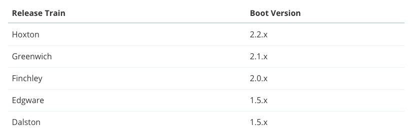
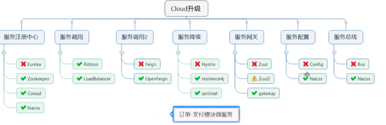

# spring-could-2020
spring cloud学习笔记，基于spring boot 2.新版本，集成Spring Cloud、Spring Cloud Alibaba相关微服务组件。

# 一、版本选择

## 1.1 Spring Boot版本选择

git源码地址：

http://github.com/spring-projects/spring-boot/releases/

2.0版本说明：

https://github.com/spring-projects/spring-boot/wiki/Spring-Boot-2.0-Release-Notes

> 官方强烈建议我们升级到2.x版本

查看spring boot最新版本:

https://spring.io/projects/spring-boot

## 1.2 Spring Cloud版本选择

官网地址：

https://spring.io/projects/spring-cloud

可通过官网查看最新版本。

## 1.3 spring boot和spring cloud依赖关系

官网地址：

https://spring.io/projects/spring-cloud#overview

可以找到spring boot对应的 spring cloud版本推荐。



也可访问：https://start.spring.io/actuator/info

获取更详细的依赖信息。

# 二、本项目使用版本

Spring Cloud：Hoxton.SR1

Spring Boot：2.2.RELEASE

Spring Alibaba Cloud：alibaba 2.1.0.RELEASE

java：1.8

Maven：3.5及以上

# 三、总体使用组件



# 四、创建父工程

1.新建普通maven工程

2.添加pom文件

```xml
<?xml version="1.0" encoding="UTF-8"?>
<project xmlns="http://maven.apache.org/POM/4.0.0"
         xmlns:xsi="http://www.w3.org/2001/XMLSchema-instance"
         xsi:schemaLocation="http://maven.apache.org/POM/4.0.0 http://maven.apache.org/xsd/maven-4.0.0.xsd">
    <modelVersion>4.0.0</modelVersion>

    <groupId>com.chengxiaoxiao.springcloud</groupId>
    <artifactId>spring-cloud-parent</artifactId>
    <version>1.0-SNAPSHOT</version>

    <!--统一管理jar包和版本-->
    <properties>
        <project.build.sourceEncoding>UTF-8</project.build.sourceEncoding>
        <maven.compiler.source>1.8</maven.compiler.source>
        <maven.compiler.target>1.8</maven.compiler.target>
        <junit.version>4.12</junit.version>
        <log4j.version>1.2.17</log4j.version>
        <lombok.version>1.16.18</lombok.version>
        <mysql.version>8.0.18</mysql.version>
        <druid.verison>1.1.16</druid.verison>
        <mybatis.spring.boot.verison>1.3.0</mybatis.spring.boot.verison>
    </properties>
    <dependencyManagement>
        <dependencies>
            <!--spring boot 2.2.2-->
            <dependency>
                <groupId>org.springframework.boot</groupId>
                <artifactId>spring-boot-dependencies</artifactId>
                <version>2.2.2.RELEASE</version>
                <type>pom</type>
                <scope>import</scope>
            </dependency>
            <!--spring cloud Hoxton.SR1-->
            <dependency>
                <groupId>org.springframework.cloud</groupId>
                <artifactId>spring-cloud-dependencies</artifactId>
                <version>Hoxton.SR1</version>
                <type>pom</type>
                <scope>import</scope>
            </dependency>
            <!--spring cloud alibaba 2.1.0.RELEASE-->
            <dependency>
                <groupId>com.alibaba.cloud</groupId>
                <artifactId>spring-cloud-alibaba-dependencies</artifactId>
                <version>2.2.0.RELEASE</version>
                <type>pom</type>
                <scope>import</scope>
            </dependency>
            <!-- MySql -->
            <dependency>
                <groupId>mysql</groupId>
                <artifactId>mysql-connector-java</artifactId>
                <version>${mysql.version}</version>
            </dependency>
            <!-- Druid -->
            <dependency>
                <groupId>com.alibaba</groupId>
                <artifactId>druid-spring-boot-starter</artifactId>
                <version>${druid.verison}</version>
            </dependency>
            <!-- mybatis-springboot整合 -->
            <dependency>
                <groupId>org.mybatis.spring.boot</groupId>
                <artifactId>mybatis-spring-boot-starter</artifactId>
                <version>${mybatis.spring.boot.verison}</version>
            </dependency>
            <!--lombok-->
            <dependency>
                <groupId>org.projectlombok</groupId>
                <artifactId>lombok</artifactId>
                <version>${lombok.version}</version>
            </dependency>
            <!--junit-->
            <dependency>
                <groupId>junit</groupId>
                <artifactId>junit</artifactId>
                <version>${junit.version}</version>
            </dependency>
            <!-- log4j -->
            <dependency>
                <groupId>log4j</groupId>
                <artifactId>log4j</artifactId>
                <version>${log4j.version}</version>
            </dependency>
        </dependencies>
    </dependencyManagement>

    <build>
        <plugins>
            <plugin>
                <groupId>org.springframework.boot</groupId>
                <artifactId>spring-boot-maven-plugin</artifactId>
                <configuration>
                    <fork>true</fork>
                    <addResources>true</addResources>
                </configuration>
            </plugin>
        </plugins>
    </build>

</project>
```

dependencyManagement节点是管理依赖版本号的一种方式。可以使子模块无需，添加版本号。dependencyManagement只是声明，并不添加依赖。以此达到统一版本处理。

父工程创建完成了，要先执行mvn:install将父工程发布到仓库，方便子工程继承。

# 五、REST基础微服务

## 5.1 微服务提供者

1.建module

2.改POM文件

```pom
<dependencies>
        <dependency>
            <groupId>org.springframework.boot</groupId>
            <artifactId>spring-boot-starter-web</artifactId>
        </dependency>
        <dependency>
            <groupId>org.springframework.boot</groupId>
            <artifactId>spring-boot-starter-actuator</artifactId>
        </dependency>
        <dependency>
            <groupId>org.mybatis.spring.boot</groupId>
            <artifactId>mybatis-spring-boot-starter</artifactId>
        </dependency>
        <dependency>
            <groupId>com.alibaba</groupId>
            <artifactId>druid-spring-boot-starter</artifactId>
        </dependency>
        <dependency>
            <groupId>mysql</groupId>
            <artifactId>mysql-connector-java</artifactId>
        </dependency>
        <dependency>
            <groupId>org.springframework.boot</groupId>
            <artifactId>spring-boot-starter-jdbc</artifactId>
        </dependency>
        <dependency>
            <groupId>org.springframework.boot</groupId>
            <artifactId>spring-boot-devtools</artifactId>
            <scope>runtime</scope>
            <optional>true</optional>
        </dependency>
        <dependency>
            <groupId>org.projectlombok</groupId>
            <artifactId>lombok</artifactId>
            <optional>true</optional>
        </dependency>
        <dependency>
            <groupId>org.springframework.boot</groupId>
            <artifactId>spring-boot-starter-test</artifactId>
        </dependency>

    </dependencies>
```

3.yml文件修改

```yml
server:
  port: 8001

spring:
  application:
    name: cloud-payment-service

  datasource:
    type: com.alibaba.druid.pool.DruidDataSource
    driver-class-name: com.mysql.cj.jdbc.Driver
    url: jdbc:mysql://192.168.4.188:3306/cloud2020?characterEncoding=utf8&useSSL=false&serverTimezone=UTC&rewriteBatchedStatements=true
    username: root
    password: 123456

mybatis:
  mapper-locations: classpath:mapper/*.xml
  type-aliases-package: com.chengxiaoxiao.cloud.entities #所有entity别名所在包
```

添加数据库：

```sql
DROP TABLE IF EXISTS `payment`;
CREATE TABLE `payment` (
  `id` bigint(20) NOT NULL AUTO_INCREMENT,
  `serial` varchar(200) DEFAULT NULL,
  PRIMARY KEY (`id`)
) ENGINE=InnoDB DEFAULT CHARSET=utf8;
```

添加entities

```java
@Data
@AllArgsConstructor
@NoArgsConstructor
public class Payment implements Serializable {
    private Long id;
    private String serial;
}
```

添加CommonResult

```code
@Data
@AllArgsConstructor
@NoArgsConstructor
public class CommonResult<T> {
    private Integer code;
    private String msg;
    private T data;
}
```

添加Dao层

```java
@Mapper
public interface PaymentDao {
    int create(Payment payment);

    Payment getPaymentById(@Param("id") Long id);
}
```

添加service

```java
@Service
public class PaymentServiceImpl implements PaymentService {

    @Resource
    private PaymentDao paymentDao;

    @Override
    public int create(Payment payment) {
        return paymentDao.create(payment);
    }

    @Override
    public Payment getPaymentById(Long id) {
        return paymentDao.getPaymentById(id);
    }
}

```

添加mapper.xml文件

```xml
<?xml version="1.0" encoding="UTF-8" ?>
<!DOCTYPE mapper PUBLIC "-//mybatis.org//DTD Mapper 3.0//EN" "http://mybatis.org/dtd/mybatis-3-mapper.dtd" >
<mapper namespace="com.chengxiaoxiao.cloud.dao.PaymentDao">
    <insert id="create" parameterType="Payment" useGeneratedKeys="true" keyProperty="id">
        insert into payment(serial) values(#{serial})
    </insert>


    <resultMap id="BaseResultMap" type="com.chengxiaoxiao.cloud.entities.Payment">
        <id column="id" property="id" jdbcType="BIGINT"/>
        <id column="serial" property="serial" jdbcType="VARCHAR"/>
    </resultMap>

    <select id="getPaymentById" parameterType="Long" resultMap="BaseResultMap">
        select * from payment where id=#{id}
    </select>
</mapper>
```


postman测试


